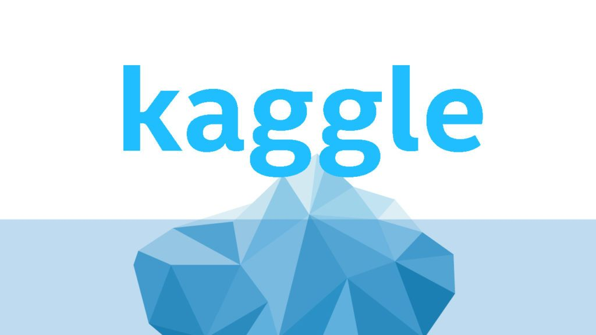

# Kaggle Solutions

>These are my codes for kaggle competitions and practices.
## Description 
There's not much to it really. After finishing some Data Science and Machine Learning online courses, I figured that I needed a way to brush up on my skills and actually put that knowledge into use.
### Set up
- It is run using Visual Studion Code
- Mac M1 Machine
- Most of the codes will be written in Python
## Author Information:
- Facebook - [Huynh Khac Tam](https://www.facebook.com/hkt456/)
- Github - [HKT456](https://github.com/hkt456)
- Personal Email - [Huynh Khac Tam](tamhuynhkhac@gmail.com)             
- Linkedin - [Huynh Khac Tam](https://www.linkedin.com/in/hkt456/)
